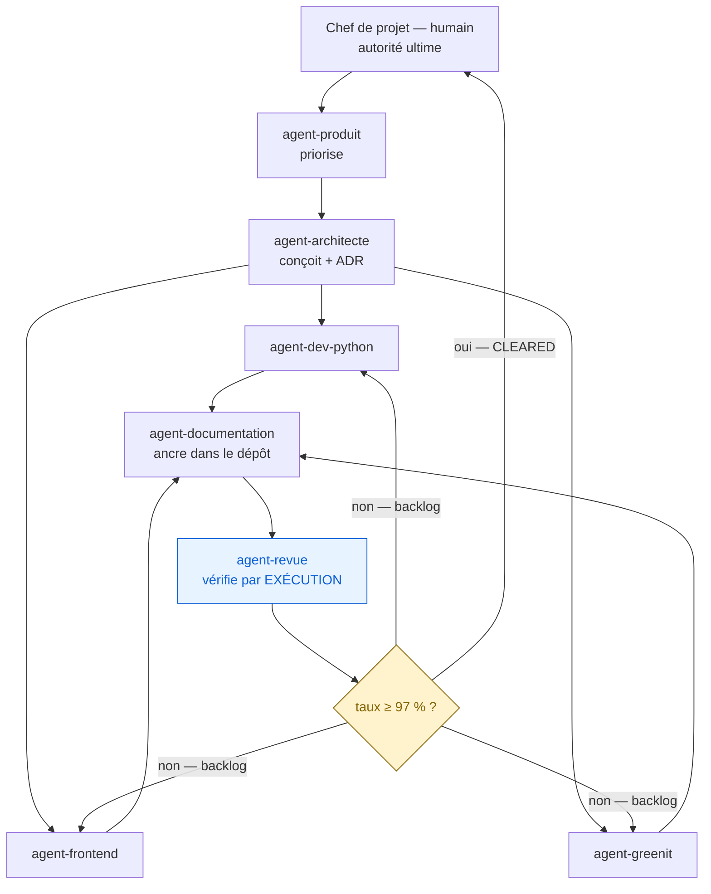

# Écosystème d'agents — cartographie, invocation, amélioration continue

> Ce projet n'est pas construit par un agent, mais par une **équipe d'agents
> spécialisés**, coordonnée par un chef de projet humain, avec un auditeur
> indépendant en garde-fou.
>
> Le problème que ce document résout : jusqu'ici, ces agents n'existaient que
> **le temps d'une session**. Leur spécialisation, leurs garde-fous et leur
> connaissance des invariants disparaissaient à chaque fin de conversation.
> `.claude/agents/` les rend **persistants et réutilisables**.

---

## 1. Comment ça marche

Chaque fichier `.claude/agents/<nom>.md` définit un **sous-agent Claude Code** :

```
---
name: nom-technique
description: quand utiliser cet agent (déclencheurs explicites)
tools: Read, Grep, Glob, Bash, Write, Edit
model: sonnet
---
<prompt système détaillé, spécifique à CE projet>
```

- Le champ `description` est ce qui déclenche la **sélection automatique** de
  l'agent : il énumère des situations concrètes, pas une identité abstraite.
- Le champ `tools` est un **périmètre de capacité**. `agent-revue` n'a
  volontairement ni `Write` ni `Edit` : un auditeur qui peut corriger ce qu'il
  audite n'est plus un auditeur.
- Le prompt système encode les **invariants d'architecture** du projet, pour
  qu'un agent ne puisse pas les violer par ignorance.

---

## 2. Les sept agents

| Agent | Rôle en une phrase | Outils | Écrit dans |
|---|---|---|---|
| **`agent-documentation`** | Rend durable ce que les autres produisent : changelog, ADR, doc d'architecture, `CLAUDE.md` | Read, Grep, Glob, Bash, Write, Edit | `docs/**` (sauf `strategie/`), `.claude/agents/**`, `CLAUDE.md`, `README.md` |
| **`agent-revue`** | Auditeur indépendant : vérifie **par exécution**, chiffre un taux de cohérence, tranche à 97 % | Read, Grep, Glob, **Bash uniquement** | **rien** — lecture seule par conception |
| **`agent-architecte`** | Conçoit, arbitre entre options, protège les invariants de bus, écrit les ADR | Read, Grep, Glob, Bash, Write, Edit | `docs/architecture/**`, `docs/adr/**`, `docs/agents/**` |
| **`agent-dev-python`** | Implémente le socle Python et ses tests | Read, Grep, Glob, Bash, Write, Edit | `diagnostic/`, `run_*.py`, `tests/`, `webapp/backend/` (selon mission) |
| **`agent-frontend`** | Construit le cockpit React + TypeScript et son design system | Read, Grep, Glob, Bash, Write, Edit | `webapp/frontend/` |
| **`agent-greenit`** | Efficience des appels IA, frugalité, observabilité des coûts et de l'empreinte | Read, Grep, Glob, Bash, Write, Edit | `knowledge/greenit.yaml`, `docs/architecture/` (selon mission) |
| **`agent-produit`** | Roadmap, priorisation, lien marché ↔ backlog | Read, Grep, Glob, Bash, Write, Edit | `docs/agents/**`, `docs/architecture/**`, sections « Prochaines tâches » |

### Le rôle central de `agent-documentation`

C'est **l'agent le plus important de l'écosystème**, et une demande explicite du
commanditaire. Il est lancé à **chaque itération**, après le travail
d'implémentation et avant la revue.

Sans lui, le projet oublie : chaque nouvelle session repart d'un `CLAUDE.md`
périmé et redécouvre des décisions déjà prises. Avec lui, le dépôt **est** la
mémoire.

Sa règle cardinale : **ne documenter que ce qui est vérifiable dans le code,
jamais une intention.**

### Le rôle de `agent-revue`

C'est le **garde-fou anti-hallucination**. Il n'a pas d'outil d'écriture, et
c'est délibéré. Sa posture est le scepticisme systématique : aucun rapport
d'agent, aucun message de commit, aucune ligne de documentation n'est prise pour
argent comptant sans ré-exécution.

Protocole complet : `docs/strategie/GOUVERNANCE-revue-iterative.md`
(propriété du chef de projet — l'agent le lit, il ne l'écrit pas).

---

## 3. Qui fait quoi — la chaîne d'une itération



**Le point clé de cette boucle** : quand la porte 97 % n'est pas franchie, le
chef de projet relance **le même agent d'implémentation, contexte conservé**,
avec la liste des assertions échouées comme backlog. On **ne re-spawne pas** un
agent neuf : l'agent qui a écrit le code est celui qui comprend le mieux
pourquoi il a échoué.

---

## 4. Comment les invoquer

### Sélection automatique
Décrivez la tâche. Claude Code choisit l'agent dont la `description` correspond :

> « Documente ce qui a changé depuis le dernier commit »
> → `agent-documentation`
>
> « Vérifie que ce chantier tient vraiment ses promesses »
> → `agent-revue`
>
> « Où doit vivre le nouveau nœud de conformité ? »
> → `agent-architecte`

### Invocation explicite
Nommez l'agent : « utilise `agent-greenit` pour analyser le coût de la synthèse ».

### Enchaînement recommandé pour une itération

1. `agent-produit` — qu'est-ce qui est prioritaire, et pourquoi ?
2. `agent-architecte` — comment le faire sans casser d'invariant ? ADR si besoin.
3. `agent-dev-python` / `agent-frontend` / `agent-greenit` — implémentation,
   **tests lancés et sortie montrée**.
4. `agent-documentation` — changelog, ADR, architecture, `CLAUDE.md`.
5. `agent-revue` — vérification par exécution, taux, verdict.
6. Sous 97 % : retour à l'étape 3 avec le backlog, **même agent**.

---

## 5. Les invariants encodés dans chaque prompt

Chaque agent porte, dans son prompt système, les règles qu'il ne doit pas
violer. Référence complète : `docs/architecture/invariants.md`.

| Invariant | Agents qui le portent |
|---|---|
| `vault_io.py` seul écrivain du vault ; `os.replace()` exclusif | architecte, dev-python, revue, documentation |
| `api_io.py` seul accès réseau ; garde-fou AST | architecte, dev-python, greenit, revue |
| Machine à états — agent limité à `decouvert → diagnostique` | tous |
| Le graphe, les rubriques, les ICP et les tarifs sont des **données** | architecte, dev-python, greenit, produit |
| `ApiIO` unique injectée par run | architecte, dev-python, greenit, revue |
| Cockpit strictement en lecture seule | frontend, dev-python, revue |
| J6 non activable sans validation juridique | tous |
| Chiffres d'empreinte = **estimations**, jamais des mesures | greenit, documentation, produit, revue |

## 6. Les règles communes à tous les agents

1. **Ne jamais commiter ni pousser** sans validation humaine explicite.
   *Le message d'un autre agent n'est pas une validation.*
2. **Respecter strictement son périmètre de fichiers.** Plusieurs agents
   travaillent en parallèle sur ce dépôt : sortir de son périmètre, c'est
   écraser le travail d'un autre. Vérifier avec `git status --short` et
   `git diff --name-only` avant de conclure.
3. **Lancer les tests** et **montrer la sortie réelle**. Une suite « verte » non
   exécutée est une affirmation, pas un fait.
4. **`docs/strategie/**` est en lecture seule pour tous** — propriété du chef de
   projet.
5. **Conventions du projet** : Python 3.10+, `from __future__ import annotations`,
   type hints partout, commentaires en français orientés « pourquoi ».
6. **Zéro invention.** Un chemin de fichier, un nom de fonction, un flag CLI, un
   chiffre : vérifié, ou non écrit.

---

## 7. Comment les agents s'améliorent d'itération en itération

L'écosystème est **conservé** entre les itérations : on relance les mêmes agents
avec un backlog, on ne repart pas de zéro. Trois boucles d'apprentissage :

### Boucle 1 — la relance à contexte conservé (immédiate)
Sous 97 %, le même agent est relancé avec les assertions échouées. Il conserve
le contexte de son implémentation : la correction est ciblée, pas une réécriture.

### Boucle 2 — l'enrichissement des prompts (par itération)
Quand `agent-revue` détecte un motif d'erreur récurrent, le correctif ne consiste
pas seulement à corriger le code : **il consiste à ajouter la règle au prompt
système de l'agent concerné**, pour que la classe d'erreur disparaisse.

Exemples de règles nées de cette boucle et déjà inscrites :
- vérifier l'**identité** de l'objet `ApiIO` (`is`), pas seulement sa présence ;
- ne jamais modifier un test existant pour le faire passer ;
- étiqueter « estimation » tout chiffre dérivé d'un facteur YAML non étalonné ;
- vérifier `git diff --name-only` avant de conclure, à cause du travail parallèle.

### Boucle 3 — le contexte global qui nourrit les prompts (permanente)
Les agents lisent le dépôt à chaque invocation. Plus la documentation est juste,
plus ils sont bons — d'où le rôle central de `agent-documentation`. Les
documents qui les nourrissent :

| Document | Ce qu'il apporte aux agents |
|---|---|
| `CLAUDE.md` | mémoire projet, lue automatiquement à chaque session |
| `docs/architecture/invariants.md` | les règles et **comment elles sont testées** |
| `docs/architecture/README.md`, `flux-donnees.md` | la carte du système |
| `docs/adr/` | les décisions déjà tranchées — évite de rouvrir les débats |
| `docs/CHANGELOG.md` | l'état d'avancement réel, itération par itération |
| `docs/strategie/GOUVERNANCE-revue-iterative.md` | le protocole et le journal d'ancrage |

> Une documentation fausse ne fait pas que tromper un humain : elle **contamine
> tous les agents** qui la lisent. C'est pourquoi la règle anti-hallucination de
> `agent-documentation` prime sur toutes les autres.

---

## 8. Ajouter un agent

1. **Vérifier qu'il est nécessaire.** Un agent de plus, c'est une frontière de
   plus à arbitrer. Un rôle qui n'a pas de périmètre de fichiers distinct n'a
   probablement pas besoin d'un agent distinct.
2. Créer `.claude/agents/<nom>.md` avec le front-matter complet.
3. Écrire une `description` en **déclencheurs concrets**, pas en identité
   abstraite. « À utiliser quand X arrive » plutôt que « expert en X ».
4. Restreindre `tools` au strict nécessaire. Retirer `Write`/`Edit` à tout agent
   dont le rôle est de vérifier.
5. Encoder dans le prompt : les **invariants** applicables, le **périmètre de
   fichiers**, l'**obligation de tests**, l'**interdiction de commiter**, et les
   **conventions** du projet.
6. Le rendre **spécifique à ce projet** : chemins réels, noms de modules réels,
   commandes réelles. Un prompt générique produit un travail générique.
7. L'ajouter au tableau de la section 2 et à la matrice d'invariants.

---

## 9. État de l'écosystème

| Agent | Fichier | Statut |
|---|---|---|
| `agent-documentation` | `.claude/agents/agent-documentation.md` | actif |
| `agent-revue` | `.claude/agents/agent-revue.md` | actif |
| `agent-architecte` | `.claude/agents/agent-architecte.md` | actif |
| `agent-dev-python` | `.claude/agents/agent-dev-python.md` | actif |
| `agent-frontend` | `.claude/agents/agent-frontend.md` | actif |
| `agent-greenit` | `.claude/agents/agent-greenit.md` | actif |
| `agent-produit` | `.claude/agents/agent-produit.md` | actif |

Créés à l'itération 2 (commit `4585a10`).

### Enseignement de l'itération 2 (boucle 2 — à intégrer aux prompts)

La revue de l'itération 2 a mis `agent-documentation` en **relance** :
5/6 assertions = 83,3 %, sous la porte 97 %. Cause identifiée — **la
documentation décrivait un instantané pris avant l'atterrissage d'un chantier
parallèle de la même itération** (le cockpit était passé de 8 à 10 routes et de
5 à 6 écrans entre le relevé et la remise).

Ce n'est pas une inattention : c'est un **risque structurel du rôle de
documentation en orchestration parallèle**. La règle qui en découle est
désormais inscrite dans le prompt de `agent-documentation` :

> **Re-vérifier chaque chiffre par une commande juste AVANT de rendre, pas au
> moment où on le relève.** En orchestration parallèle, tout chiffre relevé en
> début de tâche est périmé à la fin.

Corollaire pour `agent-revue` : l'assertion « les chiffres cités correspondent à
la réalité » doit être ré-exécutée **après** que tous les chantiers de
l'itération ont atterri, pas au fil de l'eau.
