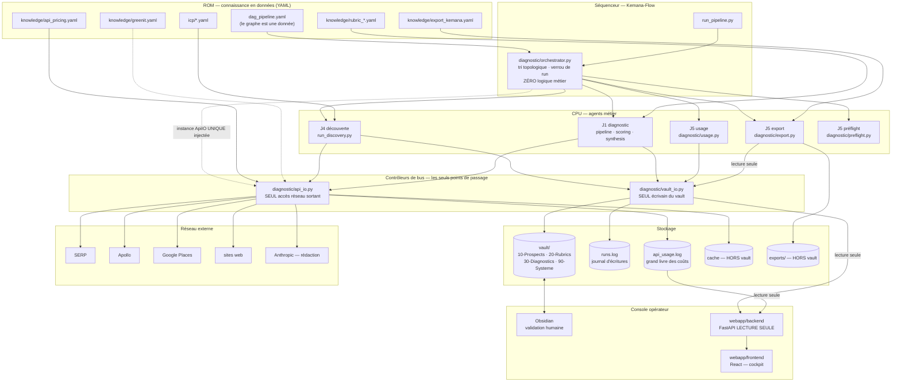
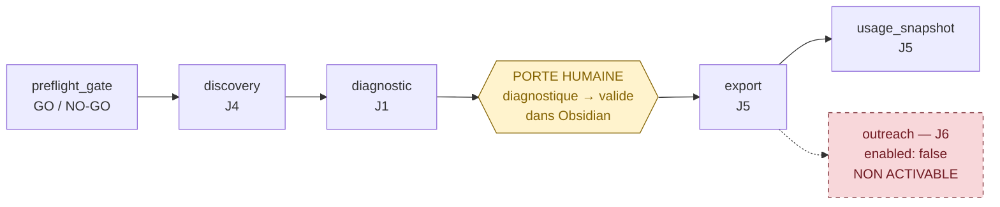

# Architecture — Système Autonome de Diagnostic Marketing (« Kemana-Flow »)

> **Statut de ce document.** Il décrit l'architecture **réelle** telle que
> lisible dans le dépôt à la date de sa dernière mise à jour, pas une cible.
> Ce qui est en cours de construction est marqué `[EN COURS]` et fera l'objet
> d'une seconde passe documentaire.
>
> Dernière vérification : **2026-08-01**, branche
> `claude/diagnostic-as-is-fonctionnalites-7kzdj4`, commit de tête `2ed8d93`.

## Table des documents

| Document | Contenu |
|---|---|
| `docs/architecture/README.md` | ce fichier — vue d'ensemble et diagramme |
| `docs/architecture/invariants.md` | les règles non négociables et **comment elles sont testées** |
| `docs/architecture/flux-donnees.md` | la chaîne de bout en bout, entrée par entrée |
| `docs/adr/` | décisions structurantes (ADR) |
| `docs/CHANGELOG.md` | historique des itérations |
| `docs/agents/ECOSYSTEME.md` | cartographie des agents de construction |

---

## 1. Ce que fait le système

Entrée : un profil de client idéal (ICP). Sortie : une liste de prospects
qualifiés, chacun accompagné d'un **diagnostic de marque scoré** et d'un
mini-audit rédigé, prête à être exploitée par une consultante solo.

Entre les deux, cinq briques historiques (J1 à J5), une couche
d'ordonnancement, et une console d'observation :

| Brique | Rôle | Entrypoint |
|---|---|---|
| **J1 — pipeline diagnostic** | entreprise → signaux → score → synthèse rédigée | `run_diagnostic.py` |
| **J2 — bus vault** | persistance Obsidian, machine à états, journal | `init_vault.py`, `diagnostic/vault_io.py` |
| **J3 — bus I/O** | tous les appels réseau : cache, budget, grand livre | `diagnostic/api_io.py` |
| **J4 — découverte** | SERP → candidats → fiches `decouvert`, enrichissement Apollo | `run_discovery.py` |
| **J5 — sortie + préflight** | export Kemana, agrégat d'usage, contrôles GO/NO-GO | `run_export.py`, `run_usage.py`, `run_preflight.py` |
| **CORE — orchestrateur DAG** | ordonnancement déterministe de toute la chaîne | `run_pipeline.py` |
| **Cockpit** | console web **lecture seule** au-dessus du vault | `webapp/backend`, `webapp/frontend` |
| **J6 — outreach** | séquence d'emails | **non implémenté, non activable** |

---

## 2. Le modèle mental : un micro-ordinateur

Cette analogie n'est pas décorative. Elle explique **pourquoi** le système est
auditable : chaque ressource partagée a **un seul contrôleur de bus**, et tout
le monde passe par lui.

| Rôle matériel | Composant | Conséquence pratique |
|---|---|---|
| Stockage persistant | `vault/` — Markdown + frontmatter YAML | source de vérité, versionnable, lisible à l'œil nu |
| **Contrôleur de bus stockage** | `diagnostic/vault_io.py` | **seul** module à lire/écrire `vault/` ; écriture atomique ; journal `runs.log` |
| **Contrôleur de bus I/O réseau** | `diagnostic/api_io.py` | **seul** module dont les fonctions touchent le réseau ; cache, budgets, grand livre `api_usage.log` |
| CPU (unités de calcul) | pipeline J1, découverte J4, export J5 | logique métier, sans accès direct aux bus |
| Séquenceur / horloge | `diagnostic/orchestrator.py` + `dag_pipeline.yaml` | ordre déterministe, verrou de run, zéro logique métier |
| ROM (données figées) | `knowledge/*.yaml`, `icp/*.yaml`, `vault/_templates/` | changer un comportement métier = éditer une donnée |
| Disque de travail | `.cache/` (api_io, manifestes de run) | **toujours hors du vault** (contrainte G9) |
| Périphérique de sortie | `exports/` — CSV/JSONL Kemana | **hors vault**, hors versionnement |
| Console opérateur | Obsidian (décision) + `webapp/` (observation) | l'humain valide ; le cockpit ne fait que montrer |
| Grand livre | `api_usage.log` (coûts) · `runs.log` (écritures vault) | JSONL append-only, sources de vérité recalculables |

---

## 3. Vue d'ensemble



**Ce que le diagramme dit et qu'il faut retenir :** aucune flèche ne va d'un
agent métier vers le réseau ou vers le stockage sans passer par un contrôleur de
bus. C'est l'unique raison pour laquelle les coûts et les écritures sont
intégralement traçables.

---

## 4. L'orchestrateur DAG « Kemana-Flow »

Décision de fond : `docs/adr/0001-orchestrateur-dag-deterministe.md`.

`diagnostic/orchestrator.py` est une **couche mince d'ordonnancement** au-dessus
de J1-J5. Elle branche, ordonne, journalise, s'arrête — et rien d'autre.

### Le graphe



Le graphe vit dans `dag_pipeline.yaml`. **Ajouter, désactiver ou réordonner une
étape = éditer ce YAML, jamais le code de l'orchestrateur.**

### Propriétés garanties

| Propriété | Mécanisme dans le code |
|---|---|
| Ordre **déterministe** | `tri_topologique()` — algorithme de Kahn avec départage **alphabétique** : deux exécutions du même DAG donnent exactement la même séquence |
| **Verrou de run** | `RunLock` — fichier créé atomiquement par `os.open(..., O_CREAT\|O_EXCL)`, libéré en `try/finally` via le context manager. Un second run lève `VerrouExiste` |
| **Reprise idempotente** | `_est_satisfait()` — le nœud `diagnostic` est sauté s'il ne reste aucune fiche `decouvert` |
| **Séquentiel strict** | boucle `for` sur l'ordre topologique. Aucun parallélisme : l'ambiguïté « export ∥ outreach » a été tranchée en faveur du séquentiel |
| **Zéro logique métier** | chaque nœud est un adaptateur qui délègue à un entrypoint existant (`run_discovery.run`, `run_diagnostic._build_pipeline`, `diagnostic.export`, `diagnostic.usage`, `diagnostic.preflight`) |
| **`ApiIO` unique** | une seule instance créée dans `Orchestrateur.__init__`, portée par `ContexteRun`, **injectée** dans les nœuds réseau. Un seul grand livre, un seul garde-fou budgétaire pour toute la chaîne |
| **Arrêt propre sur budget** | `BudgetExceeded` est capturée par nœud → statut `budget_depasse`, la chaîne s'arrête, ce qui est écrit reste valide |
| **Traçabilité du run** | manifeste JSON sous `.cache/orchestrator/<run_id>.json` : `run_id`, fenêtre `[début, fin]`, statut de chaque nœud. Corrèle a posteriori `runs.log` et `api_usage.log` **par intervalle temporel**, sans modifier leur schéma |

Statuts possibles d'un nœud : `execute`, `saute`, `desactive`, `bloque`,
`budget_depasse`, `echec`. Les trois derniers arrêtent la chaîne.

### La porte humaine

L'orchestrateur ne déclenche **que** la transition agent
`decouvert → diagnostique`. Le passage `diagnostique → valide` est un acte
**humain**, réalisé dans Obsidian. L'export ne sort que des fiches déjà
validées : la porte le précède, et aucun code ne peut la franchir.

### CLI

```bash
python run_pipeline.py --icp persona1-quebec
python run_pipeline.py --icp persona1-quebec --dry-run
python run_pipeline.py --icp persona1-quebec --depuis diagnostic
python run_pipeline.py --icp persona1-quebec --jusqu-a discovery
python run_pipeline.py --icp persona1-quebec --vault chemin/vers/vault
python run_pipeline.py --dag autre_graphe.yaml
```

Code de sortie : `0` = chaîne OK, `1` = arrêt (NO-GO préflight, budget dépassé,
nœud bloquant ou échec). Les `run_*.py` historiques continuent de fonctionner
seuls : l'orchestrateur ne les remplace pas, il les ordonne.

---

## 5. Le cockpit opérateur (`webapp/`)

Complément web d'Obsidian, **strictement en lecture seule**.

### Backend — `webapp/backend/` (FastAPI)

Huit routes, toutes en `GET`, CORS limité aux origines de développement Vite,
méthodes autorisées réduites à `GET` :

| Route | Rôle |
|---|---|
| `GET /api/health` | état du système |
| `GET /api/preflight` | verdict GO/NO-GO et détail des contrôles |
| `GET /api/pipeline/funnel` | entonnoir par statut |
| `GET /api/prospects` | liste filtrable (`statut`, `persona`, `marche`) |
| `GET /api/prospects/{slug}` | fiche + rapport de diagnostic |
| `GET /api/usage` | agrégat du grand livre (`depuis` optionnel) |
| `GET /api/icp` | ICP disponibles |
| `GET /api/runs` | dernières lignes de `runs.log` |

Les routes restent minces ; l'accès au package `diagnostic` est concentré dans
`webapp/backend/services.py`. Le backend n'écrit rien, ne fait aucune
transition, n'appelle jamais `api_io`, et ne dépend ni de `requests` ni de
`anthropic`.

Configuration par variables d'environnement : `VAULT_PATH`, `API_USAGE_LOG`,
`RUNS_LOG`, `PREFLIGHT_ROOT_DIR`.

### Frontend — `webapp/frontend/` (React 18 + Vite + TypeScript)

Cinq écrans : Dashboard (`/`), Prospects (`/prospects`), Détail
(`/prospects/:slug`), Usage (`/usage`), Préflight (`/preflight`).
Thème clair **et** sombre piloté par `src/theme.css`. Mode mock hors ligne via
`src/mocks/fixtures.ts` : l'application se démontre sans backend. Tests Vitest +
Testing Library sous `src/__tests__/`.

Aucune dépendance de graphiques ni d'UI kit : `FunnelBars`, `StatTile`,
`StatusPill`, `VerdictBanner` sont écrits à la main. Frugalité assumée.

---

## 6. État réel du système — limites à ne pas masquer

Vérifié le 2026-08-01. Ces limites sont **structurelles et voulues** : ce sont
les garde-fous qui fonctionnent, pas des défauts à contourner.

| Constat | Preuve | Conséquence |
|---|---|---|
| **Aucune clé API dans l'environnement** | `SERP_API_KEY`, `APOLLO_API_KEY`, `GOOGLE_PLACES_API_KEY`, `ANTHROPIC_API_KEY` absentes | aucun run réel possible ; tout tourne hors ligne (stubs + repli déterministe) |
| **Tarifs et budgets à 0** | `knowledge/api_pricing.yaml` : tous les `prix_par_unite` à `0.0`, `releve_le: null`, `budgets.serp.unites_max.requetes: 0`, `budgets.apollo.unites_max.credits: 0` | **préflight NO-GO structurel** ; aucun coût affiché n'est engageant |
| **Vault non initialisé** | `vault/` est vide — `init_vault.py` n'a pas été exécuté | contrôle `vault_initialise` du préflight en échec |
| **J6 outreach non activable** | `dag_pipeline.yaml` : `outreach.enabled: false` ; `Orchestrateur._run_outreach()` renvoie systématiquement `bloque` | aucun email ne peut partir. Levée conditionnée à une **validation juridique** : CASL (QC), nLPD + art. 3 LCD (CH), RGPD (FR), transparence AI Act |
| **Chiffres d'empreinte = estimations** | facteurs paramétrables en YAML, aucune mesure certifiée n'existe chez les fournisseurs | toute valeur énergie/CO₂e doit être étiquetée « estimation » |

Lever les trois premières limites relève de la **Phase D** (paramétrage par
l'opératrice : variables d'environnement + YAML), pas du développement.

---

## 7. Chantiers en cours `[EN COURS]`

Ces travaux sont menés en parallèle au moment de la rédaction. **Cette section
sera complétée en seconde passe**, une fois leur contenu réellement vérifiable
dans le dépôt. Rien de ce qui suit ne doit être considéré comme livré.

| Chantier | Périmètre annoncé | Ancre de documentation |
|---|---|---|
| **GreenIT** | `knowledge/greenit.yaml`, module(s) d'efficience (emplacement à confirmer : socle et/ou cockpit), effets sur `api_io.py` / `api_schema.py` / `synthesis.py` | ADR `docs/adr/0002-greenit-efficience-et-observabilite.md` — chiffres et arborescence à compléter |
| **Intégration e2e** | `tests/integration/**`, `scripts/**` | colonne « Comment c'est testé » de `invariants.md` — à compléter |
| **Collecteurs / découverte** | `diagnostic/discovery.py`, `diagnostic/enrichment.py`, `diagnostic/collectors/*` | tableau des collecteurs de `flux-donnees.md` §4 — à réviser |
| **Cockpit** | `webapp/**` (backend, frontend, écran GreenIT) | section 5 de ce document — à réviser |

`knowledge/greenit.yaml` **existe déjà** dans l'arbre de travail (non commité au
moment de la rédaction) et pose trois leviers — routage déterministe, frugalité,
observabilité — ainsi qu'un avertissement méthodologique explicite sur le statut
d'**estimation** des facteurs d'empreinte.

> **Point de vigilance pour la seconde passe** : des artefacts GreenIT sont
> apparus côté cockpit pendant la rédaction. Il faudra vérifier que le cockpit
> reste **strictement en lecture seule** (invariant I14) et qu'il ne recalcule
> rien que le grand livre ne contienne déjà — sans quoi deux sources de vérité
> coexisteraient sur les coûts.

---

## 8. Trajectoire

| Palier | Contenu | Statut |
|---|---|---|
| **1** | Orchestrateur DAG déterministe, CLI unique, graphe en donnée, `ApiIO` unique injectée, cockpit lecture seule | **livré** (itération 1) |
| **2** | Critique de grounding déterministe · conformité-par-donnée (`compliance/*.yaml` par marché) · routage de modèle piloté par YAML | cible — le routage de modèle est amorcé par le chantier GreenIT `[EN COURS]` |
| **3** | Fragments multi-tenant (gateway métrée par tenant, isolation, coût par tenant) | **gelé** jusqu'à un seuil de tenants payants défini à l'avance |

Refus explicites et durables : le **superviseur-planificateur LLM** (coût,
non-déterminisme, charge cognitive) et l'inversion de l'invariant du vault
(le vault **est** la source de vérité, il n'est pas un read-model).
