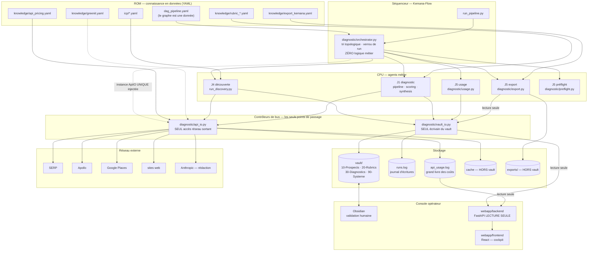
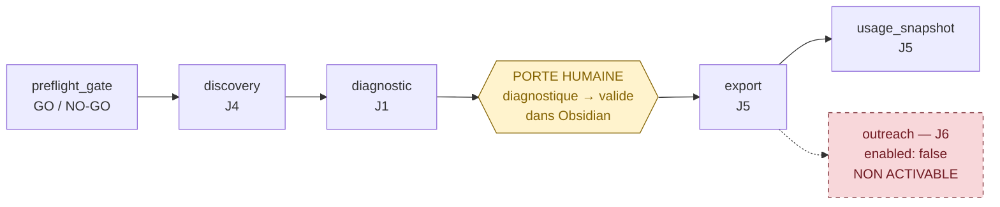

# Architecture — Système Autonome de Diagnostic Marketing (« Kemana-Flow »)

> **Statut de ce document.** Il décrit l'architecture **réelle** telle que
> lisible dans le dépôt à la date de sa dernière mise à jour, pas une cible.
> Ce qui est en cours de construction est marqué `[EN COURS]` et fera l'objet
> d'une seconde passe documentaire.
>
> Dernière vérification : **2026-08-03**, branche
> `claude/diagnostic-as-is-fonctionnalites-7kzdj4`, commit de tête `cc99302`
> (itération 4 : axe `intention`, ADR 0004, Lots 1-2 + volet export du Lot 3
> implémentés — après l'itération 3 : garde-fou documentaire `671ebeb`/`7e41cb4`,
> moteur de scoring à trois états `f77b4a6`/`4827474`, multi-industrie ADR 0003
> `356c361`/`db0af6e`).
> Comptes vérifiés par exécution : `tests/` **650** · `tests/integration` **56** ·
> backend **49** · front **34** · **24** invariants.
>
> Voir aussi `docs/architecture/PARADIGMES.md` : **pourquoi** chacune de ces
> bascules a été décidée et ce qu'elle interdit désormais — ce document-ci
> décrit l'état, PARADIGMES.md décrit les arbitrages qui y ont mené.

## Table des documents

| Document | Contenu |
|---|---|
| `docs/architecture/README.md` | ce fichier — vue d'ensemble et diagramme |
| `docs/architecture/PARADIGMES.md` | les bascules structurantes : pourquoi chaque arbitrage a été pris, ce qu'il interdit désormais |
| `docs/architecture/invariants.md` | les règles non négociables et **comment elles sont testées** |
| `docs/architecture/flux-donnees.md` | la chaîne de bout en bout, entrée par entrée |
| `docs/adr/` | décisions structurantes (ADR) |
| `docs/CHANGELOG.md` | historique des itérations |
| `docs/agents/ECOSYSTEME.md` | cartographie des agents de construction |

---

## 1. Ce que fait le système

Entrée : un profil de client idéal (ICP). Sortie : une liste de prospects
qualifiés, chacun accompagné d'un **diagnostic de marque scoré** et d'un
mini-audit rédigé, prête à être exploitée par une consultante solo.

Entre les deux, cinq briques historiques (J1 à J5), une couche
d'ordonnancement, et une console d'observation :

| Brique | Rôle | Entrypoint |
|---|---|---|
| **J1 — pipeline diagnostic** | entreprise → signaux → score → synthèse rédigée | `run_diagnostic.py` |
| **J2 — bus vault** | persistance Obsidian, machine à états, journal | `init_vault.py`, `diagnostic/vault_io.py` |
| **J3 — bus I/O** | tous les appels réseau : cache, budget, grand livre | `diagnostic/api_io.py` |
| **J4 — découverte** | SERP → candidats → fiches `decouvert`, enrichissement Apollo | `run_discovery.py` |
| **J5 — sortie + préflight** | export Kemana, agrégat d'usage, contrôles GO/NO-GO | `run_export.py`, `run_usage.py`, `run_preflight.py` |
| **CORE — orchestrateur DAG** | ordonnancement déterministe de toute la chaîne | `run_pipeline.py` |
| **Cockpit** | console web **lecture seule** au-dessus du vault | `webapp/backend`, `webapp/frontend` |
| **J6 — outreach** | séquence d'emails | **non implémenté, non activable** |

---

## 2. Le modèle mental : un micro-ordinateur

Cette analogie n'est pas décorative. Elle explique **pourquoi** le système est
auditable : chaque ressource partagée a **un seul contrôleur de bus**, et tout
le monde passe par lui.

| Rôle matériel | Composant | Conséquence pratique |
|---|---|---|
| Stockage persistant | `vault/` — Markdown + frontmatter YAML | source de vérité, versionnable, lisible à l'œil nu |
| **Contrôleur de bus stockage** | `diagnostic/vault_io.py` | **seul** module à lire/écrire `vault/` ; écriture atomique ; journal `runs.log` |
| **Contrôleur de bus I/O réseau** | `diagnostic/api_io.py` | **seul** module dont les fonctions touchent le réseau ; cache, budgets, grand livre `api_usage.log` |
| CPU (unités de calcul) | pipeline J1, découverte J4, export J5 | logique métier, sans accès direct aux bus |
| Séquenceur / horloge | `diagnostic/orchestrator.py` + `dag_pipeline.yaml` | ordre déterministe, verrou de run, zéro logique métier |
| ROM (données figées) | `knowledge/*.yaml`, `icp/*.yaml`, `vault/_templates/` | changer un comportement métier = éditer une donnée |
| Disque de travail | `.cache/` (api_io, manifestes de run) | **toujours hors du vault** (contrainte G9) |
| Périphérique de sortie | `exports/` — CSV/JSONL Kemana | **hors vault**, hors versionnement |
| Console opérateur | Obsidian (décision) + `webapp/` (observation) | l'humain valide ; le cockpit ne fait que montrer |
| Grand livre | `api_usage.log` (coûts) · `runs.log` (écritures vault) | JSONL append-only, sources de vérité recalculables |

---

## 3. Vue d'ensemble



**Ce que le diagramme dit et qu'il faut retenir :** aucune flèche ne va d'un
agent métier vers le réseau ou vers le stockage sans passer par un contrôleur de
bus. C'est l'unique raison pour laquelle les coûts et les écritures sont
intégralement traçables.

---

## 4. L'orchestrateur DAG « Kemana-Flow »

Décision de fond : `docs/adr/0001-orchestrateur-dag-deterministe.md`.

`diagnostic/orchestrator.py` est une **couche mince d'ordonnancement** au-dessus
de J1-J5. Elle branche, ordonne, journalise, s'arrête — et rien d'autre.

### Le graphe



Le graphe vit dans `dag_pipeline.yaml`. **Ajouter, désactiver ou réordonner une
étape = éditer ce YAML, jamais le code de l'orchestrateur.**

### Propriétés garanties

| Propriété | Mécanisme dans le code |
|---|---|
| Ordre **déterministe** | `tri_topologique()` — algorithme de Kahn avec départage **alphabétique** : deux exécutions du même DAG donnent exactement la même séquence |
| **Verrou de run** | `RunLock` — fichier créé atomiquement par `os.open(..., O_CREAT\|O_EXCL)`, libéré en `try/finally` via le context manager. Un second run lève `VerrouExiste` |
| **Reprise idempotente** | `_est_satisfait()` — le nœud `diagnostic` est sauté s'il ne reste aucune fiche `decouvert` |
| **Séquentiel strict** | boucle `for` sur l'ordre topologique. Aucun parallélisme : l'ambiguïté « export ∥ outreach » a été tranchée en faveur du séquentiel |
| **Zéro logique métier** | chaque nœud est un adaptateur qui délègue à un entrypoint existant (`run_discovery.run`, `run_diagnostic._build_pipeline`, `diagnostic.export`, `diagnostic.usage`, `diagnostic.preflight`) |
| **`ApiIO` unique** | une seule instance créée dans `Orchestrateur.__init__`, portée par `ContexteRun`, **injectée** dans les nœuds réseau. Un seul grand livre, un seul garde-fou budgétaire pour toute la chaîne |
| **Arrêt propre sur budget** | `BudgetExceeded` est capturée par nœud → statut `budget_depasse`, la chaîne s'arrête, ce qui est écrit reste valide |
| **Traçabilité du run** | manifeste JSON sous `.cache/orchestrator/<run_id>.json` : `run_id`, fenêtre `[début, fin]`, statut de chaque nœud. Corrèle a posteriori `runs.log` et `api_usage.log` **par intervalle temporel**, sans modifier leur schéma |

Statuts possibles d'un nœud : `execute`, `saute`, `desactive`, `bloque`,
`budget_depasse`, `echec`. Les trois derniers arrêtent la chaîne.

### La porte humaine

L'orchestrateur ne déclenche **que** la transition agent
`decouvert → diagnostique`. Le passage `diagnostique → valide` est un acte
**humain**, réalisé dans Obsidian. L'export ne sort que des fiches déjà
validées : la porte le précède, et aucun code ne peut la franchir.

### CLI

```bash
python run_pipeline.py --icp persona1-quebec
python run_pipeline.py --icp persona1-quebec --dry-run
python run_pipeline.py --icp persona1-quebec --depuis diagnostic
python run_pipeline.py --icp persona1-quebec --jusqu-a discovery
python run_pipeline.py --icp persona1-quebec --vault chemin/vers/vault
python run_pipeline.py --dag autre_graphe.yaml
```

Code de sortie : `0` = chaîne OK, `1` = arrêt (NO-GO préflight, budget dépassé,
nœud bloquant ou échec). Les `run_*.py` historiques continuent de fonctionner
seuls : l'orchestrateur ne les remplace pas, il les ordonne.

---

## 5. Le cockpit opérateur (`webapp/`)

Complément web d'Obsidian, **strictement en lecture seule**.

### Backend — `webapp/backend/` (FastAPI)

**Dix routes**, toutes en `GET`, CORS limité aux origines de développement Vite,
méthodes autorisées réduites à `GET`
(contrôle : `python -c "from webapp.backend.app import app; print(len([r for r in app.routes if getattr(r,'path','').startswith('/api')]))"` → `10`) :

| Route | Rôle |
|---|---|
| `GET /api/health` | état du système |
| `GET /api/preflight` | verdict GO/NO-GO et détail des contrôles |
| `GET /api/pipeline/funnel` | entonnoir par statut |
| `GET /api/prospects` | liste filtrable (`statut`, `persona`, `marche`) |
| `GET /api/prospects/{slug}` | fiche + rapport de diagnostic |
| `GET /api/usage` | agrégat du grand livre (`depuis` optionnel) |
| `GET /api/greenit` | agrégats d'efficience — coût, appels, cache, énergie et CO₂e **estimés** |
| `GET /api/greenit/stream` | flux SSE — observabilité temps réel (tail du grand livre par offset) |
| `GET /api/icp` | ICP disponibles |
| `GET /api/runs` | dernières lignes de `runs.log` |

Les routes restent minces ; l'accès au package `diagnostic` est concentré dans
`webapp/backend/services.py`, et la lecture/agrégation du grand livre pour
GreenIT dans `webapp/backend/greenit.py`. Le backend n'écrit rien, ne fait
aucune transition, n'appelle jamais `api_io`, et ne dépend ni de `requests` ni
de `anthropic`.

Configuration par variables d'environnement : `VAULT_PATH`, `API_USAGE_LOG`,
`RUNS_LOG`, `PREFLIGHT_ROOT_DIR`.

### Frontend — `webapp/frontend/` (React 18 + Vite + TypeScript)

**Six écrans** : Dashboard (`/`), Prospects (`/prospects`), Détail
(`/prospects/:slug`), Usage (`/usage`), **GreenIT (`/greenit`)**,
Préflight (`/preflight`).
Thème clair **et** sombre piloté par `src/theme.css`. Mode mock hors ligne via
`src/mocks/fixtures.ts` : l'application se démontre sans backend. Tests Vitest +
Testing Library sous `src/__tests__/` (**34 tests**).

Aucune dépendance de graphiques ni d'UI kit : `FunnelBars`, `StatTile`,
`StatusPill`, `VerdictBanner` sont écrits à la main. Frugalité assumée.

---

## 6. État réel du système — limites à ne pas masquer

Vérifié le 2026-08-01. Ces limites sont **structurelles et voulues** : ce sont
les garde-fous qui fonctionnent, pas des défauts à contourner.

| Constat | Preuve | Conséquence |
|---|---|---|
| **Aucune clé API dans l'environnement** | `SERP_API_KEY`, `APOLLO_API_KEY`, `GOOGLE_PLACES_API_KEY`, `ANTHROPIC_API_KEY` absentes | aucun run réel possible ; tout tourne hors ligne (stubs + repli déterministe) |
| **Tarifs et budgets à 0** | `knowledge/api_pricing.yaml` : tous les `prix_par_unite` à `0.0`, `releve_le: null`, `budgets.serp.unites_max.requetes: 0`, `budgets.apollo.unites_max.credits: 0` | **préflight NO-GO structurel** ; aucun coût affiché n'est engageant |
| **Vault non initialisé** | `vault/` est vide — `init_vault.py` n'a pas été exécuté | contrôle `vault_initialise` du préflight en échec |
| **J6 outreach non activable** | `dag_pipeline.yaml` : `outreach.enabled: false` ; `Orchestrateur._run_outreach()` renvoie systématiquement `bloque` | aucun email ne peut partir. Levée conditionnée à une **validation juridique** : CASL (QC), nLPD + art. 3 LCD (CH), RGPD (FR), transparence AI Act |
| **Chiffres d'empreinte = estimations** | facteurs paramétrables en YAML, aucune mesure certifiée n'existe chez les fournisseurs | toute valeur énergie/CO₂e doit être étiquetée « estimation » |
| **YAML d'axe intention non calibrés** | `knowledge/intent_persona1.yaml`, `knowledge/vocabulaire_intention_persona1.yaml`, `knowledge/certifications_quebec.yaml` marqués `[À CALIBRER]` | aucun seuil (demi-vie, fenêtre de péremption, seuil de quadrant) n'a été validé par la consultante |
| **`legitimite.py` résout le marché en dur** | `MARCHE_CERTIFICATIONS_PAR_DEFAUT = "quebec"` dans `vault_runner.py`/`run_diagnostic.py`, pas par fiche | limite symétrique de celle déjà acceptée pour `vocabulaire_offre` (ADR 0003) |
| **`VaultIO.append_historique()` posée, non exploitée** | `vault/40-Historique/` existe comme mécanisme, aucun collecteur n'écrit dedans | infrastructure anticipée (ADR 0004 §D3), pas encore utile |

Lever les trois premières limites relève de la **Phase D** (paramétrage par
l'opératrice : variables d'environnement + YAML), pas du développement.

---

## 7. GreenIT — efficience et observabilité (itération 2, livré)

Décision : `docs/adr/0002-greenit-efficience-et-observabilite.md` (acceptée,
implémentée — commits `6055e14` et `d5b14d1`).

`diagnostic/greenit.py` + `knowledge/greenit.yaml` posent trois leviers, tous
pilotés par la **donnée** :

| Levier | Mécanisme |
|---|---|
| **Routage** | `choisir_modele(contexte, config)` — règles de comparaison explicites. Défaut `standard` (haiku, 600) ; escalade `qualite` (sonnet, 900) en mode `ou` sur `quality_check_echoue == true`, `nb_failles >= 6`, `score_global >= 75`. **Aucun LLM ne décide du routage** (invariant I20) |
| **Frugalité** | troncature du contexte (4 000 car.) et du prompt assemblé (8 000 car.), `max_tokens_sortie` 600 qui écrase le profil, TTL de cache 30 j, prompt caching désactivé (non rentable : un prompt par prospect) — invariant I21 |
| **Observabilité** | 7 champs sur `LedgerEntry` (`octets_entrants`, `octets_sortants`, `duree_ms`, `energie_wh`, `co2e_g`, `modele`, `profil`), tous optionnels → **les anciennes lignes se relisent sans migration**. Intensité carbone **par région** |

Restitution : rapport `run_usage.py`, route `/api/greenit`, flux SSE
`/api/greenit/stream`, écran `/greenit`.

> ⚠️ **`energie_wh` et `co2e_g` sont des ESTIMATIONS**, jamais des mesures
> certifiées (invariant I19). Facteurs = ordres de grandeur paramétrables,
> `releve_le: null`. Usage **comparatif** uniquement.
> **Aucun pourcentage d'économie n'est calculable** tant que
> `api_pricing.yaml` est à `0` : tous les coûts valent 0,00.

### Dette technique (constatée, non bloquante)

1. **Duplication du calcul de coût** entre `diagnostic/usage.py::agreger` et
   `webapp/backend/greenit.py::agreger`. Ils convergent au centime aujourd'hui
   (vérifié par la revue) mais **aucun test ne le garantit**. Le docstring du
   module cockpit annonce un test croisé `test_greenit_usage_convergence.py`
   qui **n'existe pas dans le dépôt**.
2. **`diagnostic/greenit.py` absent de la liste `_check_garde_fous_bus`** —
   couvert *de fait* par le test générique en `rglob`, mais pas par le mécanisme
   annoncé (voir I4).

Le parsing défensif du cockpit (lecture du JSONL brut plutôt que via
`LedgerEntry`) est en revanche **justifié** : un schéma d'écriture est strict par
construction, une vue de consultation doit tolérer un champ futur ou une ligne
corrompue lue à chaud. **Lecture seule stricte préservée** (invariant I14).

---

## 8. Tests d'intégration end-to-end (itération 2, livré)

`tests/integration/` — **56 tests** exécutés contre un **faux serveur HTTP
local** (`faux_api.py`), **sans aucune clé API** (commit `0234af3`, étendu à
l'itération 4 par `cc99302`).

| Fichier | Ce qu'il prouve |
|---|---|
| `test_e2e_bus.py` | cache (deux appels identiques → **une seule** requête réseau), budget interrompu **avant** l'appel, cache refusé dans le vault, machine à états inviolable, journaux append-only |
| `test_e2e_decouverte.py` | SERP → fiches `decouvert`, filtres ICP, dédup, enrichissement Apollo, minimisation RGPD, dry-run |
| `test_e2e_diagnostic.py` | collecte réelle, partage de cache Places, transition `decouvert → diagnostique`, repli déterministe **sans appel** quand la clé manque, idempotence |
| `test_e2e_export.py` | opt-out absolu, lecture seule, refus d'écrire dans le vault, colonnes Kemana (13, dont 3 intention), anomalies |
| `test_e2e_orchestrateur.py` | GO/NO-GO, chaîne cohérente, idempotence, dry-run, verrou anti-concurrence |
| `test_e2e_intention.py` (itération 4) | discrimination à besoin égal, escalade page carrières via le bus réseau, `citable=True` obligatoire, trois états préservés |

**L'apport décisif** : les invariants ne sont plus seulement prouvés par mock
mais **par le réseau**. Voir les colonnes « Comment c'est testé » de
`invariants.md` (I5, I6, I7, I15).

---

## 9. Multi-industrie — `secteur_id` comme clé de configuration (itération 3, livré)

Décision : `docs/adr/0003-icp-secteur-comme-cle-de-configuration-multi-industrie.md`
(commit `675e85d`). Lot 1 implémenté : `356c361`. Correctif cockpit
(`fiche.persona` optionnel) : `db0af6e`.

Avant cette décision, cinq défauts vérifiés par exécution plafonnaient le
système à « installateurs HVAC au Québec » — le plus grave : `run_vault_mode`
construisait **un seul** pipeline avant la boucle de traitement d'un lot vault,
appliqué à toutes les fiches quel que soit leur persona. Après :

- `secteur_id` (nouveau champ `IcpConfig`) remplace `persona: int` comme clé de
  sélection de rubrique, de vocabulaire et de fiche de connaissance. Défaut
  `secteur_id = f"persona{persona}"` si absent — rétro-compatibilité totale.
- `FicheProspect.persona` : `Literal[1, 2]` → `int | None` (borné `ge=1`).
  `FicheProspect.marche` : enum fermé → `str` validé par un motif de slug.
- `vault_runner.secteur_id_for_fiche(fiche)` résout la configuration **par
  fiche** ; `run_vault_mode` construit et met en cache **un pipeline par
  secteur rencontré dans le lot**.
- `WebsiteCollector.vocabulaire_offre: list[str] | None` injecté par le
  pipeline — vocabulaire absent → `mentions_offre = None` (inconnu), jamais
  `False` (même discipline anti-fuite que le moteur de scoring, §10).

**Ajouter un secteur/marché = trois fichiers YAML, zéro ligne de code.** Ce qui
reste un travail humain : écrire le contenu métier (`rubric_{secteur}.yaml`,
`vocabulaire_{secteur}.yaml`) — **aucune rubrique non-HVAC n'existe encore**.

Vérification : `python -m pytest tests/test_multi_industrie.py -q` (15 tests).
Détail du raisonnement : `docs/architecture/PARADIGMES.md` §P3.

---

## 10. Le moteur de scoring à trois états (itération 3, livré)

Commits `f77b4a6` (moteur) et `4827474` (collecteurs de production). Pas une
ADR — un correctif de fond au moteur existant, mais structurant au point d'être
documenté comme le paradigme le plus important du projet
(`docs/architecture/PARADIGMES.md` §P4).

`diagnostic/scoring.py` distingue trois états : `ok` / `echec` / **`inconnu`**.
Un check dont le signal vaut `None` ne produit ni point, ni dénominateur, ni
faille. Le score de chaque dimension — et le score global — est renormalisé sur
les seules dimensions **réellement observées** ; `scores["_couverture"]` publie
la part du poids total évaluée.

Cette règle a fermé la **même classe de défaut** à trois endroits distincts en
une itération : le moteur lui-même (`None` compté comme échec → 45 % de la
pondération fabriquée à zéro sans clé Google Places), les collecteurs Places
(une réponse HTTP 200 `REQUEST_DENIED` lue comme « aucune fiche trouvée »),et
le vocabulaire métier codé en dur (absence de configuration lue comme un fait
négatif). Le motif commun : **de la connaissance métier ou un échec technique
qui produit un faux négatif présenté comme une observation.**

Vérification : `python -m pytest tests/test_scoring.py tests/test_collectors_phase_d.py -q`
(19 + 38 tests).

---

## 11. Axe intention — ADR 0004 (itération 4, Lots 1-2 + volet export du Lot 3 livrés)

Décision : `docs/adr/0004-axe-intention-et-collecteurs-osint-cibles.md`
(révisée `6ba11e2` avant toute implémentation). Implémentation : `cc99302`.
Second axe, **orthogonal** au besoin — voir `docs/architecture/PARADIGMES.md`
§P6 pour le raisonnement complet.

`diagnostic/intent.py::evaluer_intention()` rejoue les checks d'une rubrique
d'intention un par un, en réutilisant **uniquement** les primitives pures
`_resolve`/`_check_passes` de `scoring.py` — jamais `ScoringEngine.score()`.
Il produit une **liste** d'`EvenementIntention` (dimension, preuve, date,
péremption, intensité, citabilité, fiabilité de source), jamais un score.
`git diff diagnostic/scoring.py` reste **vide** (invariant I23).

| Composant | Rôle |
|---|---|
| `diagnostic/models.py::EvenementIntention` | dataclass — événement daté, jamais un score |
| `diagnostic/intent.py` | rejoue les checks `nature: evenement`, écarte les checks non datés |
| `diagnostic/collectors/_decay.py::decroissance()` | fonction pure, **strictement informationnelle**, jamais câblée dans le scoring |
| `diagnostic/collectors/legitimite.py` | nouveau collecteur, palier 0 — alimente le **besoin** (dimension `legitimite_conformite`), pas l'intention |
| `diagnostic/collectors/website.py` | `vocabulaire_intention`, `offre_detectee`/`offre_detectee_date`, escalade page carrières (1 appel de plus) |
| `diagnostic/vault_schema.py` | 3 champs optionnels : `signal_intention`, `date_intention`, `intention_expire_le` |
| `diagnostic/serializers.py` | dérivation sous contrainte dure `citable=True` (invariant I24) |
| `diagnostic/vault_io.py::append_historique()` | `vault/40-Historique/<slug>.jsonl` — **posé, non exploité** |
| `knowledge/export_kemana.yaml` | 10 → 13 colonnes (3 colonnes intention, additives) |

**Banc d'essai reproductible** (`scripts/benchmark_intention.py`, mesuré le
2026-08-03, faux serveur, 9 entreprises HVAC fictives, sans clé API) :
score_global min 36,9 / max 81,5 / moyenne 46,8 ; `signal_chaud` 2 distincts
sur 9 ; `signal_intention` 1 sur 9 (« Thermo Marchand ») ; quadrant Q1=1,
Q2=0, Q3=6, Q4=2 ; couverture moyenne 0,65. **Le 2/9 est un plafond de
fixture** (le faux serveur ne modélise que 2 profils de site distincts), pas
une mesure de performance commerciale : n=1 sur l'axe intention, seuil de
quadrant `[À CALIBRER]`, aucun dénominateur commercial (`motif_rejet`
n'existe pas).

**Non fait** : Lot 0 (`motif_rejet`, états `rdv`/`client` — prérequis de
mesure avant toute **exploitation réelle** du quadrant) · Lot 0bis
(calibration graduée de `entretien.fraicheur_mois`) · reste du Lot 3 (cockpit,
4ᵉ requête Dataview, `FicheProspect.quadrant` persistant). Limite connue :
`legitimite.py` résout le marché en dur sur `"quebec"`, pas par fiche. Les
trois YAML d'intention sont des brouillons `[À CALIBRER]`, aucun seuil validé
par la consultante.

Vérification :
```bash
python -m pytest tests/test_intent.py tests/test_decay.py tests/test_legitimite.py \
  tests/test_website_intention.py tests/test_config_intent.py \
  tests/test_serializers_intention.py tests/test_vault_io_historique.py -q   # 65 tests
python -m pytest tests/integration/test_e2e_intention.py -q                 # 10 tests
git diff diagnostic/scoring.py                                             # vide
```

---

## 12. Trajectoire

| Palier | Contenu | Statut |
|---|---|---|
| **1** | Orchestrateur DAG déterministe, CLI unique, graphe en donnée, `ApiIO` unique injectée, cockpit lecture seule | **livré** (itération 1) |
| **2** | Critique de grounding déterministe · conformité-par-donnée (`compliance/*.yaml` par marché) · routage de modèle piloté par YAML | **partiellement livré** — le routage de modèle YAML est fait (ADR 0002, itération 2). Restent la critique de grounding et la conformité-par-donnée |
| **3** | Fragments multi-tenant (gateway métrée par tenant, isolation, coût par tenant) | **gelé** jusqu'à un seuil de tenants payants défini à l'avance |
| — | Multi-industrie (`secteur_id`, ADR 0003) | **livré** (itération 3) — indépendant des paliers de l'ADR 0001 |
| — | Axe `intention` daté et décroissant (ADR 0004) | **Lots 1-2 + volet export du Lot 3 livrés** (itération 4) — Lot 0, Lot 0bis et reste du Lot 3 **non faits** |

Refus explicites et durables : le **superviseur-planificateur LLM** (coût,
non-déterminisme, charge cognitive) et l'inversion de l'invariant du vault
(le vault **est** la source de vérité, il n'est pas un read-model). L'ADR 0004
en ajoute un troisième, propre à son périmètre : **aucun score composite
besoin × intention**, et aucun tri de priorité calculé automatiquement à partir
des deux axes.
