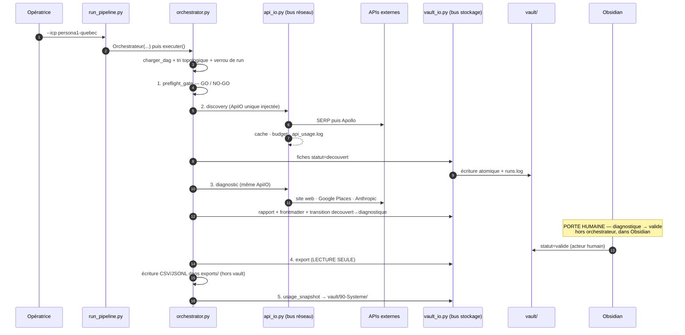
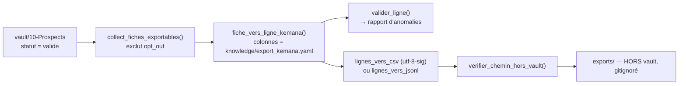

# Flux de données — de l'ICP à la liste Kemana

> Chaîne de bout en bout, telle qu'elle est réellement implémentée.
> Vérifié le **2026-08-01**, commit de tête `2ed8d93`.
> Vue d'ensemble : `docs/architecture/README.md` · Règles :
> `docs/architecture/invariants.md`.
>
> **Rappel d'état.** Aucune clé API n'est disponible dans l'environnement et
> `knowledge/api_pricing.yaml` est à `0` : la chaîne décrite ci-dessous est
> **exécutable hors ligne** (stubs et repli déterministe) mais **aucun run réel
> n'a eu lieu**. Le préflight est en NO-GO structurel et bloque le nœud 1.

---

## 0. Vue linéaire



---

## 1. Entrée — l'ICP

`icp/persona1-quebec.yaml` (aujourd'hui le seul fichier présent), validé par
`IcpConfig` (Pydantic). Contrainte de cohérence :
`icp_id == "persona{persona}-{marche}"`.

Nouveau marché ou nouveau persona = **nouveau fichier YAML, zéro code**
(invariant I16).

---

## 2. `preflight_gate` — la porte GO/NO-GO

`diagnostic/preflight.py` · aucun réseau, aucune clé utilisée (on vérifie leur
**présence**, jamais leur validité).

Neuf familles de contrôles : clés API · tarifs réels · budgets · vault
initialisé · cache hors vault · ICP valide · schéma d'export · tests verts
(non bloquant sauf `--strict`) · garde-fous de bus (AST).

- `verdict_global()` → `True` seulement si **tous** les contrôles bloquants
  passent.
- En mode réel, un NO-GO donne le statut `bloque` et **arrête la chaîne**.
- En `--dry-run`, le NO-GO est **signalé sans bloquer** (rien n'est écrit).

**Verdict actuel : NO-GO.** Causes : quatre variables d'environnement absentes,
`releve_le: null`, tous les `prix_par_unite` à `0.0`, budgets `serp` et `apollo`
à `0`, dossiers du vault absents.

---

## 3. `discovery` — J4, SERP puis Apollo

`run_discovery.run(icp_id=..., vault=..., dry_run=..., api_io=...)`,
appelé par l'orchestrateur avec **l'instance `ApiIO` unique** (invariant I11).

```mermaid
flowchart LR
    ICP["icp/*.yaml<br/>IcpConfig"] --> Q["requêtes SERP"]
    Q --> AIO["ApiIO.call('serp', …)<br/>cache · budget · ledger"]
    AIO --> C["Candidate<br/>Pydantic extra=forbid<br/>EN MÉMOIRE"]
    C --> F1["filtres + dédup intra-lot<br/>domaine normalisé"]
    F1 --> F2["dédup inter-runs<br/>vault_io.exists()"]
    F2 --> AP["ApiIO.call('apollo', …)<br/>PersonEnrichment"]
    AP --> CT["Contact — 6 champs<br/>minimisation RGPD"]
    CT --> FP["FicheProspect<br/>statut = decouvert"]
    FP --> VIO["VaultIO.write_fiche()"]
```



Points de contrôle :
- **`Candidate` n'est jamais persistée** telle quelle : `run_discovery.py` la
  mappe explicitement vers `FicheProspect`.
- **Déduplication à deux niveaux** : domaine normalisé (minuscule, sans `www.`,
  sans slash final) dans le lot, puis `vault_io.exists(site_web=…, nom=…)`
  contre le vault avant chaque écriture.
- **`Contact` est limité à 6 champs** (`extra="forbid"`) — la minimisation RGPD
  est garantie par le schéma, pas par la discipline. `contact_email_source` est
  toujours renseigné quand un email est présent (piste d'audit).
- **Aucun LLM** dans cette phase. **Aucun scraping LinkedIn ni Facebook** : les
  données « personnes » proviennent exclusivement de l'API Apollo.
- **`--dry-run`** : le SERP est exécuté et métré (le cache reste utile), mais
  **aucune écriture vault**.
- **`BudgetExceeded`** : arrêt propre, les fiches déjà écrites restent valides,
  la ré-exécution est idempotente.

---

## 4. `diagnostic` — J1, la chaîne d'analyse

`run_diagnostic._build_pipeline(api_io=…)` puis
`vault_runner.run_vault_mode(vault, pipeline)`.

```
fiche decouvert
  → collecteurs (déterministes, isolés, safe_collect)
  → signaux
  → scoring piloté par knowledge/rubric_persona1.yaml
  → synthèse rédigée (LLM) + contrôle QA
  → rapport Markdown + frontmatter mis à jour
  → transition decouvert → diagnostique   (seule transition agent)
```

### Collecteurs

| Collecteur | Palier | Source réseau | Comportement sans `api_io` / sans clé |
|---|---|---|---|
| `website.py` | 0 | `requests.get` **via `api_io`** | import paresseux de `requests` |
| `seo.py` | 0 | aucune — dérivé de `_website_signals._seo_text` | stub `local_keywords=None` |
| `social.py` | 0 | aucune — dérivé de `_website_signals.social_links` | `plateformes_mentionnees=[]` |
| `gbp.py` | 1 | Google Places `text_search` via `api_io` | stub `verified=None` |
| `reviews.py` | 1 | Google Places `text_search` + `place_details` via `api_io` | stub `count=None` |

> Ce tableau est susceptible d'évoluer : un chantier parallèle touche
> `diagnostic/collectors/*`. **À réviser en seconde passe.**

Les collecteurs **dérivés** (`seo`, `social`) n'ont aucun accès réseau propre :
après la collecte du site, le pipeline leur **injecte** `_website_signals`. Une
seule requête par cible, conformément à la politique de scraping poli.

### Scoring

`diagnostic/scoring.py` est un moteur **générique** piloté par la rubrique
(`knowledge/rubric_persona1.yaml`). Un gap est produit **par contrôle échoué** —
il n'y a volontairement pas de `seuil_faille` global, la granularité est plus
fine. Nouveau persona = nouvelle rubrique, `scoring.py` ne bouge pas.

### Synthèse

`diagnostic/synthesis.py` rédige **à partir des faits déjà établis** — le LLM ne
va jamais chercher d'information (invariant I17). Le contrôle QA vérifie
qu'aucune affirmation n'est produite sans faille réelle correspondante.
Sans `ANTHROPIC_API_KEY`, un **repli déterministe** prend le relais : c'est le
mode dans lequel tourne l'intégralité de la suite de tests aujourd'hui.

> Le chantier GreenIT `[EN COURS]` introduit un **routage de modèle déterministe
> piloté par `knowledge/greenit.yaml`** en amont de cet appel. **À compléter en
> seconde passe** : profils, règles de routage, effet mesuré.

### Écriture

`diagnostic/serializers.py` transforme le `Diagnostic` en deux objets :
- `diagnostic_to_fiche()` → mise à jour du frontmatter (score, gaps, date,
  wikilink vers le rapport) ;
- `diagnostic_to_rapport_md()` → rapport Markdown dans `vault/30-Diagnostics/`.

`signal_chaud` est **dérivé** dans `serializers.py` à partir de `diag.failles` :
il n'entre pas dans le contrat JSON de `Diagnostic`, ce qui préserve la
compatibilité de la sortie J1.

En cas d'erreur sur une fiche, l'erreur est journalisée (`vault_io.log_erreur`)
et les autres fiches continuent d'être traitées.

---

## 5. Porte humaine — `diagnostique → valide`

**Hors orchestrateur, hors code.** L'opératrice ouvre `vault/` dans Obsidian,
lit les rapports de `30-Diagnostics/`, et fait passer les fiches retenues en
`statut: valide`. Elle peut rejeter n'importe quelle fiche (`* → rejete`, état
final).

Aucun agent ne peut franchir cette porte : `TRANSITIONS_AGENT` ne contient que
`decouvert → {diagnostique}` (invariant I7). Le tableau de bord
`vault/00-Dashboard.md` fournit trois requêtes Dataview (pipeline, principaux
gaps, relance) pour piloter en **manage-by-exception**.

---

## 6. `export` — J5, la liste Kemana

`diagnostic/export.py` · **lecture seule stricte** : aucune transition d'état,
aucun appel réseau.



- **`opt_out: true` exclut une fiche sans exception** (RGPD / CASL / nLPD).
  Ce n'est pas un filtre par défaut : c'est une règle absolue.
- **Les colonnes sont une donnée** : `knowledge/export_kemana.yaml` définit dix
  colonnes (Nom, Titre, Boîte, ICP, Email, Source email, Site, Score, Signal
  chaud, Statut). Ajouter ou réordonner = éditer le YAML.
- **Encodage `utf-8-sig`** (BOM) pour une ouverture directe dans Excel en
  configuration française.
- **Refus d'écrire dans le vault** : `verifier_chemin_hors_vault()` lève une
  erreur fatale si la destination est sous `vault/`.
- Un rapport d'anomalies accompagne l'export (email manquant, champ vide…).

---

## 7. `usage_snapshot` — J5, l'agrégat de coûts

`diagnostic/usage.py` lit `api_usage.log` (`charger_ledger`), agrège
(`agreger`), formate (`formater_rapport`), puis **écrit via le bus vault** —
`vault_io.write_system_note("usage-AAAA-MM-JJ.md", …)` dans `vault/90-Systeme/`.
Aucun `open()` direct : l'invariant I1 vaut aussi pour les notes système.

Le rapport donne, par fournisseur : unités consommées, coût estimé, taux de cache
hit, erreurs de lecture.

> **Tous les coûts valent actuellement 0,00** puisque `api_pricing.yaml` est
> intégralement à `0.0`. Ce n'est pas une gratuité : c'est un paramétrage absent.
> Voir invariant I19.

---

## 8. `outreach` — J6, non activable

Déclaré dans `dag_pipeline.yaml` avec `enabled: false` et `porte_humaine: true`.
Double verrou : le nœud est sauté (statut `desactive`) et, s'il était forcé à
`true`, `Orchestrateur._run_outreach()` renvoie `bloque`.

**Pré-condition d'activation : validation juridique par un juriste** — CASL
(Québec), nLPD + art. 3 LCD (Suisse), RGPD (France), obligations de transparence
de l'AI Act. Voir invariant I18.

---

## 9. Où atterrit chaque donnée

| Donnée | Emplacement | Versionné ? | Écrit par |
|---|---|---|---|
| Fiches prospect | `vault/10-Prospects/persona{n}-{marche}/*.md` | oui (vault) | `VaultIO.write_fiche` |
| Rapports de diagnostic | `vault/30-Diagnostics/*.md` | oui | `VaultIO.write_rapport` |
| Copies de rubriques | `vault/20-Rubrics/` | oui | `init_vault.py` |
| Notes système, snapshots d'usage | `vault/90-Systeme/` | oui | `VaultIO.write_system_note` |
| Journal des écritures vault | `runs.log` (racine) | **non** (gitignoré) | `VaultIO._journal` |
| Grand livre des coûts | `api_usage.log` (racine) | **non** | `ApiIO._journaliser` |
| Cache d'appels API | `.cache/api_io/` | **non** | `ApiIO._ecrire_cache` |
| Manifestes de run | `.cache/orchestrator/<run_id>.json` | **non** | `Orchestrateur._ecrire_manifeste` |
| Verrou de run | `.run.lock` (racine) | **non** | `RunLock` |
| Exports Kemana | `exports/*.csv` / `*.jsonl` | **non** | `run_export.py` / nœud `export` |

---

## 10. Traçabilité d'un run

Les deux journaux (`runs.log`, `api_usage.log`) sont horodatés mais **n'ont pas
de champ `run_id`** — leur schéma n'a délibérément pas été modifié pour ne pas
casser les contrats existants.

La corrélation se fait donc **par intervalle temporel** : le manifeste
`.cache/orchestrator/<run_id>.json` enregistre `run_id`, `icp_id`, `dry_run`,
la fenêtre `[début, fin]` et le statut de chaque nœud. Recouper cette fenêtre
avec les horodatages des deux journaux reconstitue l'intégralité d'un run —
quelles fiches ont été écrites, quels appels ont été payés.

L'écriture du manifeste est **best-effort** : elle ne fait jamais échouer un run.

---

## 11. Points à réviser en seconde passe

| Section | Motif |
|---|---|
| §4 — tableau des collecteurs | chantier parallèle sur `diagnostic/collectors/*`, `discovery.py`, `enrichment.py` |
| §4 — synthèse | routage de modèle GreenIT à documenter (profils, règles, effet mesuré) |
| §7 — usage | colonnes d'empreinte énergie/CO₂e à documenter, avec leur statut d'estimation |
| §0 et §10 | tests d'intégration bout-en-bout (`tests/integration/**`) et scripts (`scripts/**`) à intégrer |
